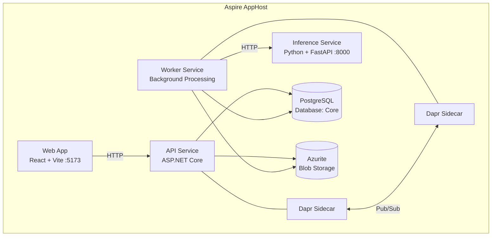

# RedactEngine

A prompt-driven video redaction engine that lets users describe via text input what should be redacted from video content.

### Live Environment

- **Frontend** — https://red-hill-0615d8410.2.azurestaticapps.net/
- **API docs (Scalar)** — https://redactengine-prod-api.salmoncoast-9bdab27f.centralus.azurecontainerapps.io/scalar

## Architecture

The project uses [.NET Aspire](https://learn.microsoft.com/en-us/dotnet/aspire/) to orchestrate all services locally. Running the AppHost starts everything — database, storage, backend, frontend, and Dapr sidecars — in one go.



## Tech Stack

| Layer | Tech |
|-------|------|
| Orchestration | .NET Aspire |
| Backend | .NET 10, ASP.NET Core, EF Core |
| Database | PostgreSQL |
| Blob Storage | Azure Blob Storage (Azurite locally) |
| Inference | Python 3.12, FastAPI, OpenCV, Grounding DINO + SAM 2 (mock mode) |
| Messaging | Dapr Pub/Sub (Azure Service Bus Queues) |
| Frontend | React 19, Vite, TypeScript, TanStack Query |
| Styling | Tailwind CSS, shadcn/ui |
| API Docs | Scalar (OpenAPI) |

## Project Structure

| Project | Purpose |
|---------|---------|
| `RedactEngine.AppHost` | Aspire orchestrator — starts all services, databases, and containers |
| `RedactEngine.ApiService` | REST API — controllers, middleware, OpenAPI |
| `RedactEngine.Worker` | Background job processing |
| `RedactEngine.Application` | Application services, validation, service contracts |
| `RedactEngine.Domain` | Domain entities, events, and invariants |
| `RedactEngine.Infrastructure` | EF Core persistence, migrations, external integrations |
| `RedactEngine.InferenceService` | Python inference service — object detection, tracking, and video redaction |
| `RedactEngine.Web` | React + Vite frontend ([details](RedactEngine.Web/README.md)) |
| `RedactEngine.Shared` | Cross-service contracts (e.g. pub/sub messages) |
| `RedactEngine.ServiceDefaults` | Shared hosting config — telemetry, health checks, resilience |
| `RedactEngine.Architecture.Tests` | Architecture convention tests (layering, DDD rules) |

## Prerequisites

Install these before you begin. Docker Desktop must be **running** whenever you start the project.

| Tool | Version | Install |
|------|---------|---------|
| .NET SDK | 10.0 | [Download](https://dotnet.microsoft.com/download/dotnet/10.0) |
| Python | 3.12+ | [Download](https://www.python.org/downloads/) |
| Docker Desktop | Latest | [Download](https://www.docker.com/products/docker-desktop/) |
| Dapr CLI | Latest | [Install guide](https://docs.dapr.io/getting-started/install-dapr-cli/) |
| Node.js | 20+ | [Download](https://nodejs.org/) |
| pnpm | 10+ | `npm install -g pnpm` or [pnpm.io](https://pnpm.io/installation) |
| FFmpeg | Latest | `winget install FFmpeg` (Win) / `brew install ffmpeg` (Mac) / `apt install ffmpeg` (Linux) |
| Visual Studio Community *(optional)* | 2022+ | [Download](https://visualstudio.microsoft.com/vs/community/) |

After installing the Dapr CLI, initialize Dapr (pulls required containers — only needed once):

```bash
dapr init
```

## Getting Started

### 1. Clone the repo

```bash
git clone <repo-url>
cd RedactEngine
```

### 2. Run the project

Make sure Docker Desktop is running, then pick one of these options. Aspire automatically installs frontend dependencies (`pnpm install`) on startup.

#### Option A — Visual Studio Community

1. Open `RedactEngine.sln`
2. Right-click `RedactEngine.AppHost` in Solution Explorer → **Set as Startup Project**
3. Press **F5** (or click the Run button)

#### Option B — VS Code / Terminal

```bash
dotnet run --project RedactEngine.AppHost
```

### 3. Open the app

Once running, the **Aspire dashboard** opens automatically in your browser. From there you can see all services, logs, and traces.

- **Frontend** — [http://localhost:5173](http://localhost:5173)
- **API docs (Scalar)** — accessible from the Aspire dashboard endpoints
- **Aspire dashboard** — opens automatically (typically `https://localhost:17193`)

## Useful Commands

```bash
# Build the solution
dotnet build RedactEngine.sln

# Run everything via Aspire
dotnet run --project RedactEngine.AppHost

# Frontend lint
cd RedactEngine.Web && pnpm lint

# Regenerate API client (after OpenAPI spec changes)
cd RedactEngine.Web && pnpm openapi-ts

# Run architecture tests
dotnet test RedactEngine.Architecture.Tests
```

## Creating a Database Migration

When you change an entity, add a new entity, or update an entity configuration, you need to create an EF Core migration so the database schema stays in sync.

```bash
# From the repo root
dotnet ef migrations add <MigrationName> --project RedactEngine.Infrastructure --startup-project RedactEngine.ApiService
```

Replace `<MigrationName>` with a short description of the change (e.g. `AddDocumentTable`, `AddStatusToUser`).

This generates a migration file in `RedactEngine.Infrastructure/Migrations/`. **Commit the generated migration file** with your PR — migrations are applied automatically on startup, so no one needs to run them manually.

> **Tip:** If you need to undo a migration you haven't pushed yet, run:
> ```bash
> dotnet ef migrations remove --project RedactEngine.Infrastructure --startup-project RedactEngine.ApiService
> ```

## CI/CD & Deployment

Deployment is **fully automatic**. When you merge a pull request into `main`, the CI/CD pipeline takes care of everything:

1. Your PR gets merged into `main`.
2. The pipeline builds, tests, and deploys both the backend and frontend — no manual steps needed.
3. Changes go live to the production URLs listed above within a few minutes.

## Good to Know

- **Database migrations run automatically** on startup — no manual `dotnet ef` commands needed.
- **`src/client/` is auto-generated** — do not edit files in `RedactEngine.Web/src/client/` manually. If the OpenAPI spec changes, regenerate with `pnpm openapi-ts`.
- **Frontend details** — see [RedactEngine.Web/README.md](RedactEngine.Web/README.md) for the frontend architecture and conventions.
